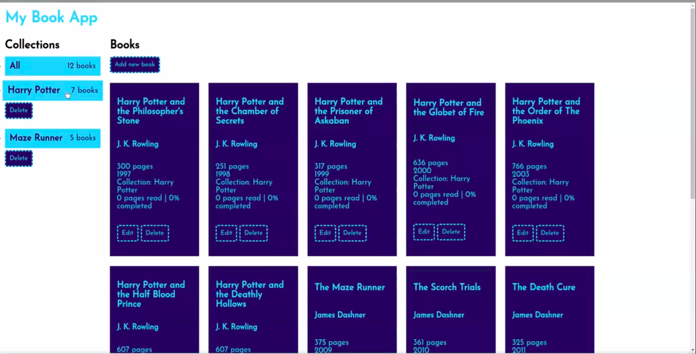
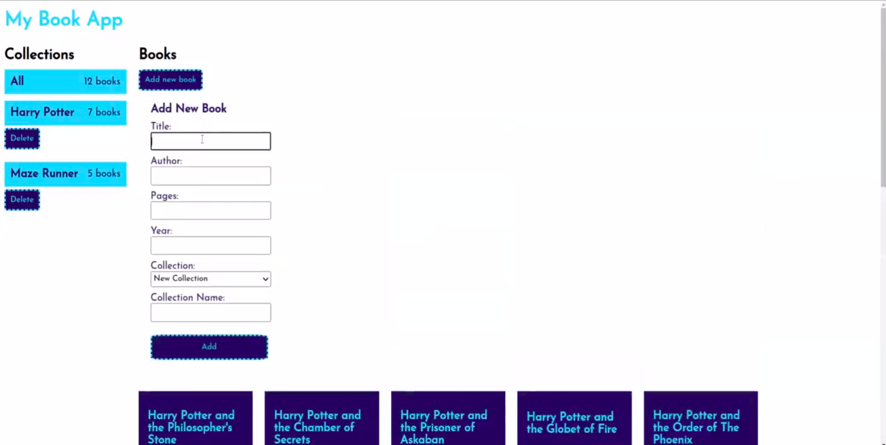

# My Book App

This is a React project that aims to create a simple CRUD app, where you can track your books.

# Features

This project implements the following features:

- Adds new books to existing collections or new collections;
- Adds new books to the All collection;
- Show books by collection;
- Show all books;
- Edits existing books infos;
- Deletes books;
- Deletes collections;

# Some preview images of the final project

[Video Preview](https://www.linkedin.com/posts/paola-matsumoto-67544b107_react-activity-6980886439764856832-9BP6?utm_source=share&utm_medium=member_desktop)
